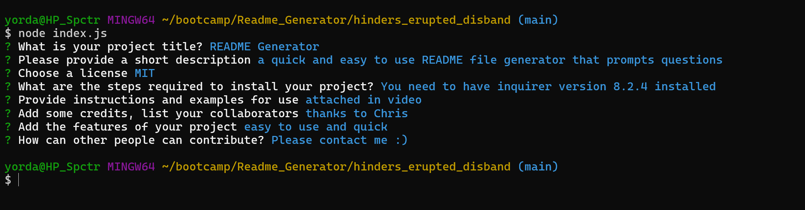

# README Generator
  
  ## Description

  This aplication asks for users input to create a professional README File

## Installation

First user need to have installed inquirer version 8.2.4

## Usage

Answer the questions that are prompted. 

## Credits

I want to thank my Instructor Chriss Stallcup for all his support.

## License

   [MIT](https://choosealicense.com/licenses/mit/)

## Features

A fast and easy to use README generator

  